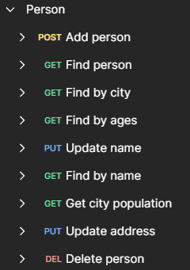

# Person Service

Person Service - это бэкенд сервис на Java для работы с данными о людях.

## Описание

- Разработан с использованием Spring Boot для создания REST API  
- Использует Spring Data JPA для работы с базой данных
- Предоставляет CRUD операции для сущности Person через REST  
- Реализует бизнес-логику serivce-слоя 
- Применяет ModelMapper для преобразования объектов в DTO
- Включает модульные тесты на Spring Boot Test
- Имеет возможность масштабирования и расширения функционала

## Используемые технологии

- Spring Boot  
- Spring Data JPA
- Spring Web
- H2 Database
- Lombok
- ModelMapper
- JUnit
- Maven

## API

## Запуск

`mvn spring-boot:run`

## Сборка

`mvn clean package`

## История изменений

- 0.0.1 
  - Начальная версия